# Heading Rail — Guide

🏠 [README](README.md) · ⚙️ [Every setting](SETTINGS.md) · 🆕 [What's new](README.md#whats-new) · 🐞 [Report a bug](https://github.com/JustDast/obsidian-heading-rail/issues)

**In short.** Heading Rail turns the headings of a note into a rail of thin bars along its edge, so you always see the whole note, where you are in it and what comes next. Point at the rail and a wave follows the cursor, a preview card shows the section, a click takes you there. Open the rail into an outline to search the headings or the text itself, move whole sections with the mouse or the keyboard, change heading levels, rename, pin, duplicate, move a section into its own note — and undo any of it. Pick a look from the catalog, then tune any detail, separately for the desktop and the phone.

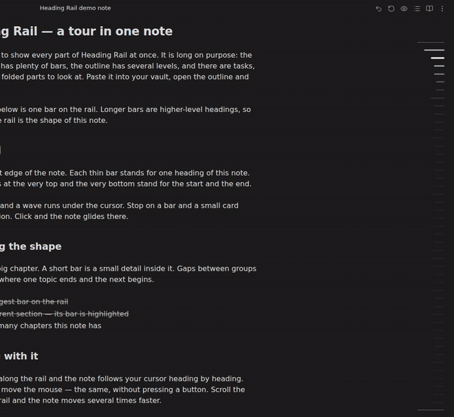

This guide follows the plugin from the first look to the last setting. Every setting with its default value is in **[Every setting](SETTINGS.md)**; the links in each section below take you to the right group there.

**Interface languages:** English · Deutsch (German) · Français (French) · Русский (Russian) · 日本語 (Japanese) · 한국어 (Korean) · हिन्दी (Hindi) · Italiano (Italian) · Español (Spanish) · Português (Portuguese) · Türkçe (Turkish) · Polski (Polish) · Українська (Ukrainian) · Tiếng Việt (Vietnamese) · Bahasa Indonesia (Indonesian) · 简体中文 (Chinese, Simplified) · 繁體中文 (Chinese, Traditional)

## Contents

1. [Getting started](#getting-started)
2. [Looks and the catalog](#looks-and-the-catalog)
3. [The settings screen](#the-settings-screen)
4. [The rail](#the-rail)
5. [Scrolling and jumps](#scrolling-and-jumps)
6. [The wave](#the-wave)
7. [Current bar and halo](#current-bar-and-halo)
8. [The outline](#the-outline)
9. [The floating button](#the-floating-button)
10. [Working with sections](#working-with-sections)
11. [Search](#search)
12. [Ctrl + hover: the slider inside a section](#ctrl--hover-the-slider-inside-a-section)
13. [Pinned sections](#pinned-sections)
14. [Marks next to entries](#marks-next-to-entries)
15. [Undo and history](#undo-and-history)
16. [Hover preview](#hover-preview)
17. [Custom CSS, images and fonts](#custom-css-images-and-fonts)
18. [Sharing and moving settings](#sharing-and-moving-settings)
19. [On the phone](#on-the-phone)
20. [Turning things off](#turning-things-off)
21. [Keys and gestures](#keys-and-gestures)
22. [Commands](#commands)
23. [Questions and problems](#questions-and-problems)
24. [Contact](#contact)

---

## Getting started

**Install.** In Obsidian open **Settings → Community plugins → Browse**, find **Heading Rail**, install and enable it. To install by hand, put `main.js`, `manifest.json` and `styles.css` from the [latest release](https://github.com/JustDast/obsidian-heading-rail/releases/latest) into `<your vault>/.obsidian/plugins/heading-rail/` and enable the plugin in **Community plugins**.

**First look.** Open any note with headings. Thin bars appear along the right edge — one bar per heading, in the colours of your Obsidian theme (the **Standard** look). In the note header the plugin adds four buttons (the book and ⋮ after them are Obsidian's own):

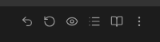

| Button | What it does |
|---|---|
| **Undo** (curved arrow) | Takes back the last action of the plugin, or returns you to where you were before a jump. See [Undo and history](#undo-and-history). |
| **History** (circular arrow) | Opens the history: deleted and copied sections, outline changes, text edits, presets and settings changes. |
| **Eye** | Turns the whole plugin off in this note (and back on). See [Turning things off](#turning-things-off). |
| **Outline** (list icon) | Opens the outline and keeps it open; press again to close it. |

**Next steps.** Point at the bars, stop on one, click. Then open **Settings → Heading Rail**: the **Catalog** button at the top has six more looks to download, and everything else can be tuned from there.

---

## Looks and the catalog

### The looks

A **preset** is a whole look applied at once: bars, wave, outline, preview, search, buttons and colours. Only **Standard** is built into the plugin; the others download from the catalog when you want them. A preset sets the profile you are editing (Desktop or Mobile) completely, so you always get the same result — and then you can change anything you like. The phone gets the same preset, adapted only where a phone needs it.

| | |
|---|---|
| 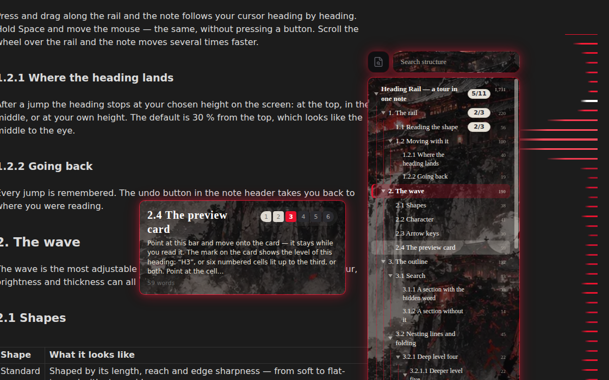 **Higanbana** — Eastern dark fantasy in anthracite, scarlet and ivory: glowing scarlet bars, an ink painting of spider lilies behind the outline, the preview and the search box, white text in an Eastern serif, a floating outline, near-black buttons that turn scarlet. Looks the same in light and dark Obsidian themes. | 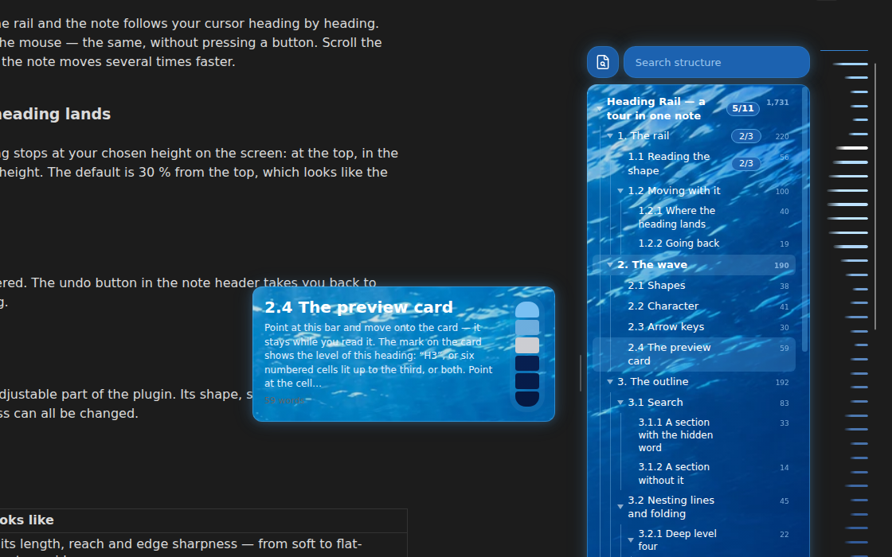 **Depth** — deep blue water with light from above: one picture runs across the outline, the search box and the preview, bars go from light to dark blue, a long smooth arc-shaped wave with the most noticeable catch-up and overshoot, a vertical level scale of wide cells, the actions menu below in rows. |
| 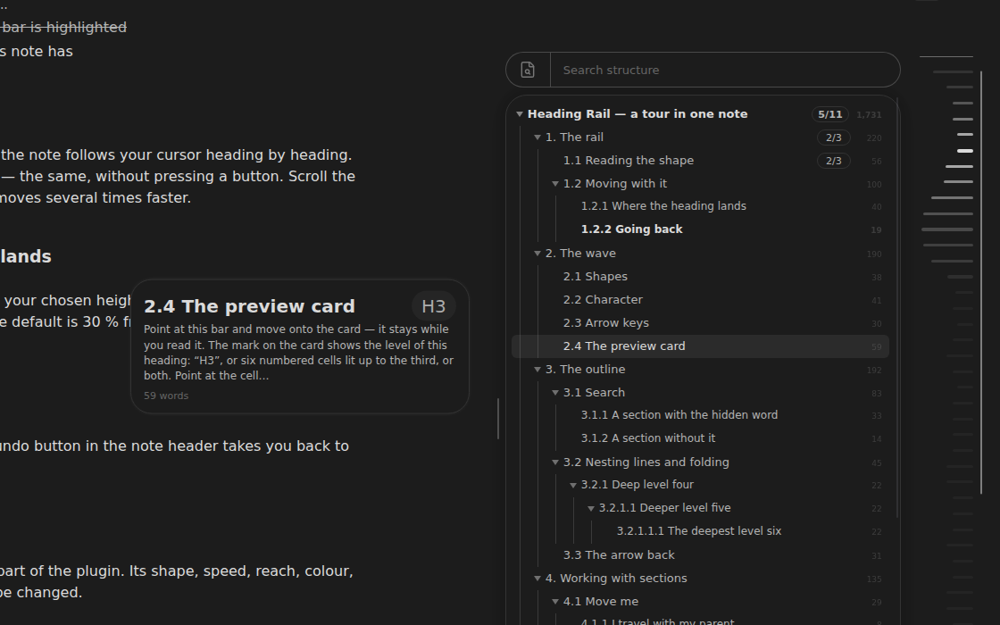 **Standard** — the default: thin bars on the right in your theme's colours, a soft wave, a joined search box, the actions menu beside the outline. Built in. | 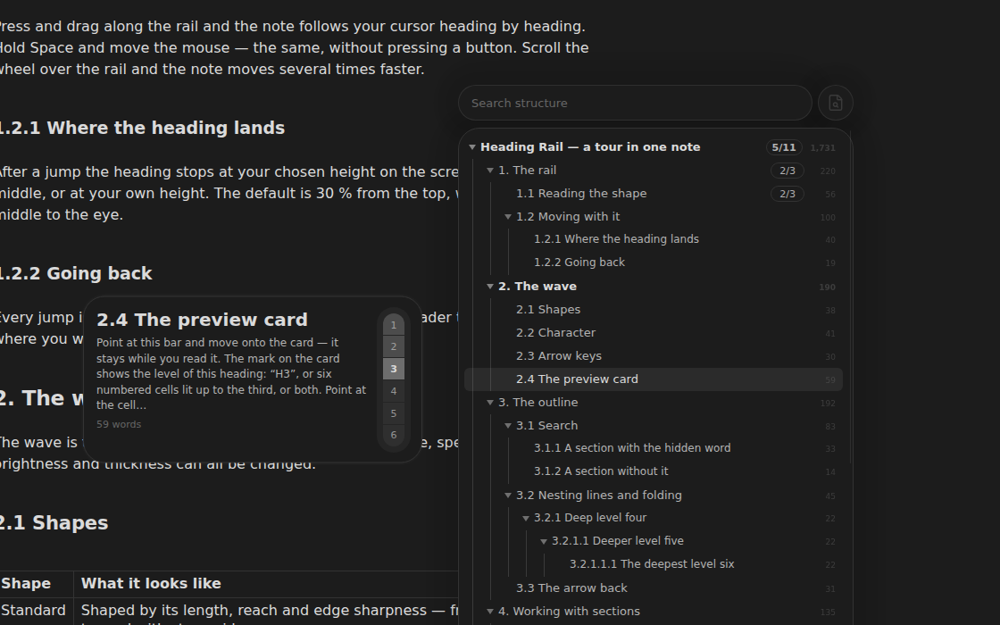 **Funkier** — bars on the left, thicker and longer, a shorter and sharper wave, the floating button, search box and button apart, the actions menu below. |
| 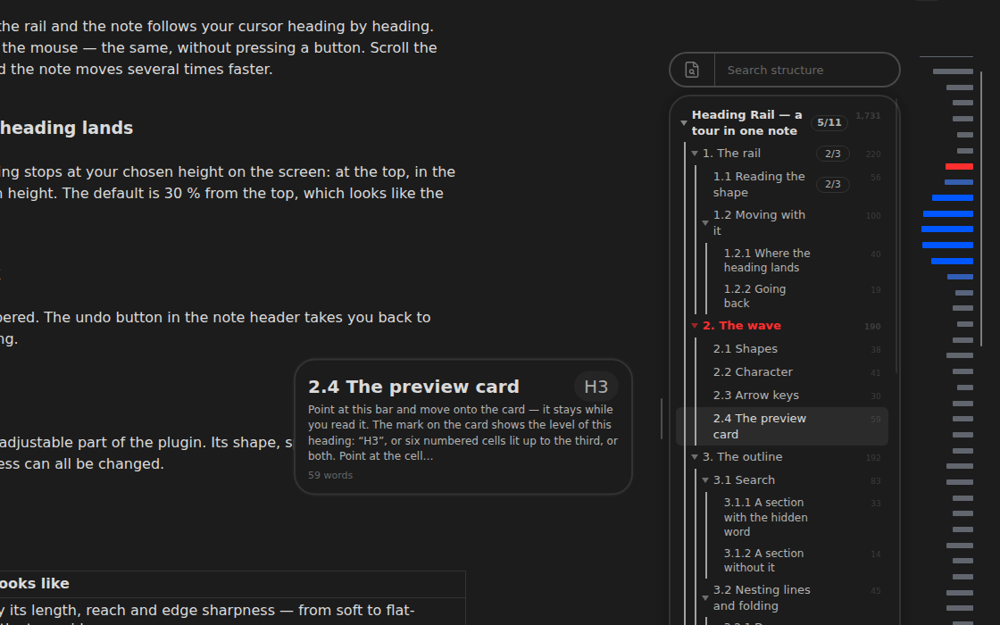 **Racer** — crisp and high-contrast: thick bars, a blue wave, the current section in red, no animation. | 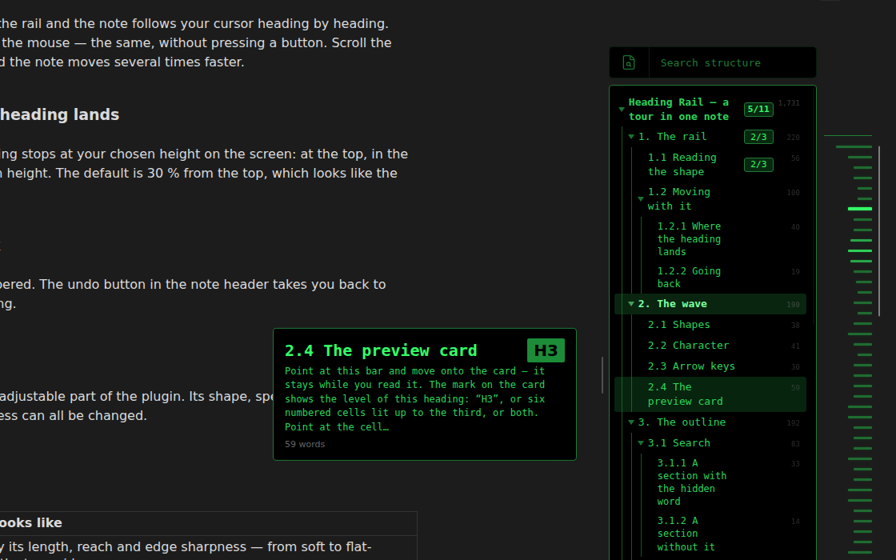 **Terminal** — green on black, a monospace font, instant jumps, green pinned entries and marks, the level as “H3” on a green tile, the actions menu below as icons. |
| 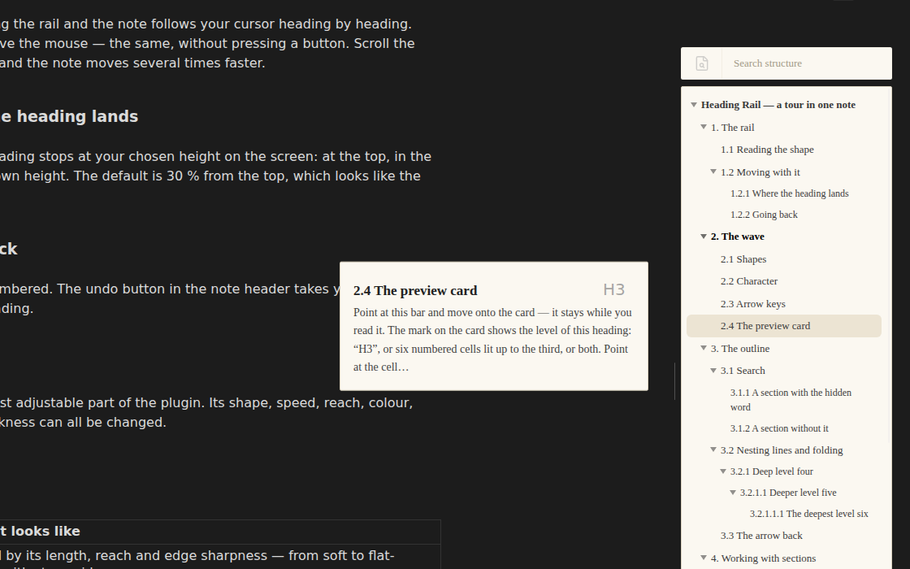 **Paper** — thin grey strokes on the left, a book font, cream windows, the outline on the right. | 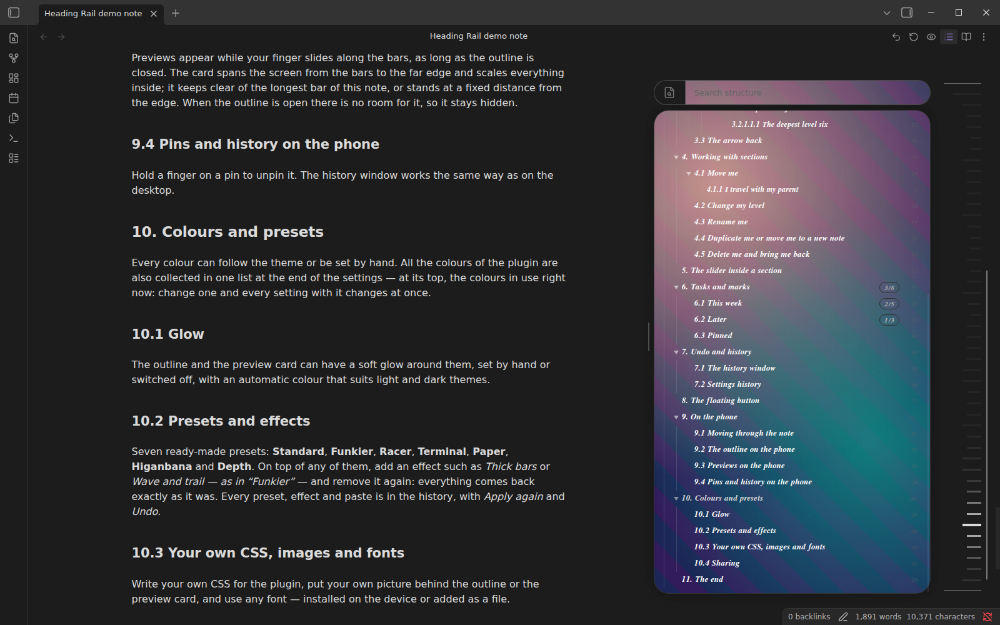 **Your own** — any look of your own with [custom CSS, images and fonts](#custom-css-images-and-fonts), shared as a file or a code. |

The same seven on a phone:

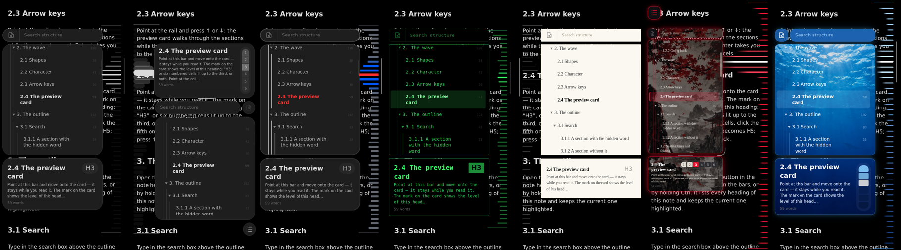

### The catalog

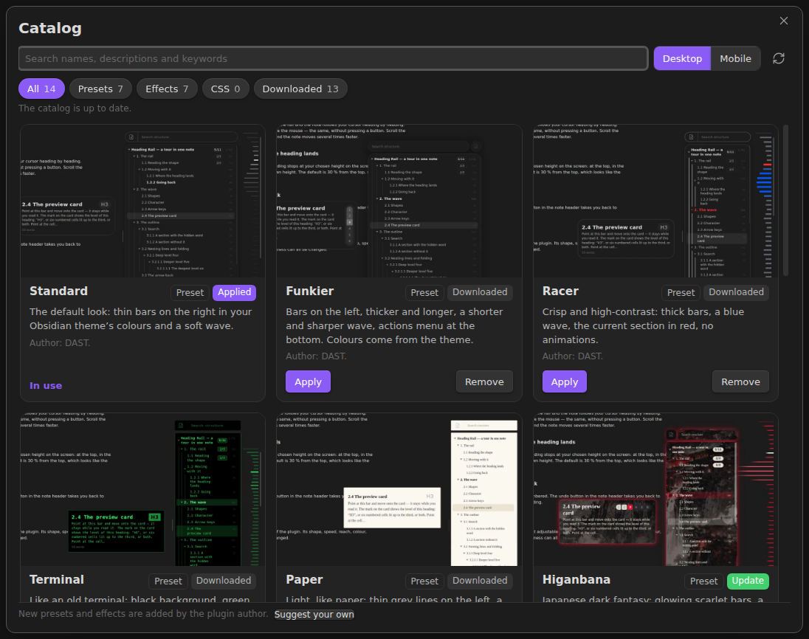

All presets, effects and CSS add-ons are in one window. Open it with:

- the **Catalog** button at the top of the settings, next to *Desktop / Mobile*;
- **Open catalog** in *Ready-made presets*;
- the command *Open the catalog of presets and effects*.

What's in it:

- **Cards** — a screenshot (click to enlarge, arrows to switch), a description in the plugin's language, the author and a state: *Applied* / *On*, *Built in*, *Downloaded*, *Update*, *New*.
- **Search** looks through names, descriptions and keywords. The chips filter *All*, *Presets*, *Effects*, *CSS* and *Downloaded*, each with its count.
- **Desktop / Mobile** chooses which profile the buttons work on — and which screenshots the cards show: with *Mobile*, every card shows the outline, the preview and the bars on a phone screen.

  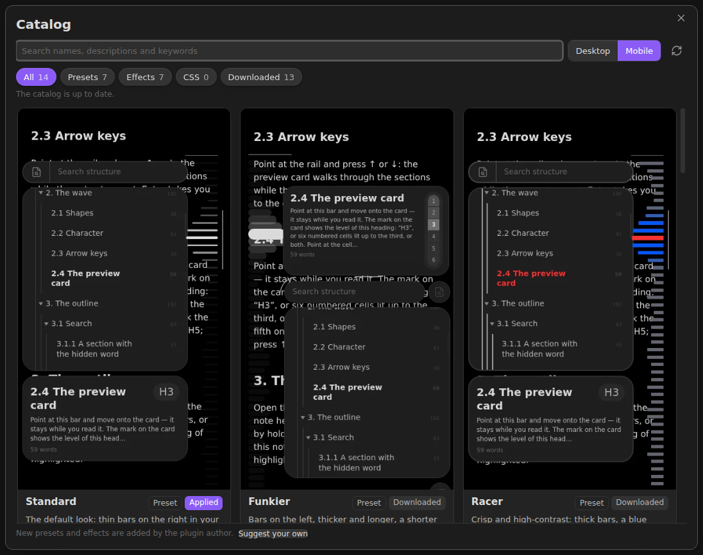
- **Download** fetches an item. Then **Apply** (a preset), **Apply / Remove** (an effect) or **Turn on / Turn off** (CSS). **Update** appears when the author has improved an item you have. **Remove** (press twice) deletes a downloaded item.
- The round arrow **refreshes** the catalog. Without a connection the catalog says so and shows what is built in and downloaded.
- Downloaded items are stored as files in the plugin's folder, not in the settings file, so the settings stay light. What you applied on one device downloads by itself on the other.
- New presets and effects are added to the catalog by the author — they appear without updating the plugin. **Suggest your own** at the bottom tells how to send yours.

### Effects

An effect goes on top of any preset and theme and changes only its own few settings. **Remove** brings back exactly what was there before the effect, even if you changed those settings by hand since. Two effects that change the same thing do not stack — the new one replaces the old one.

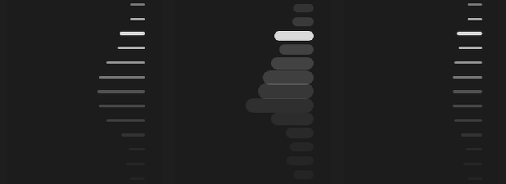

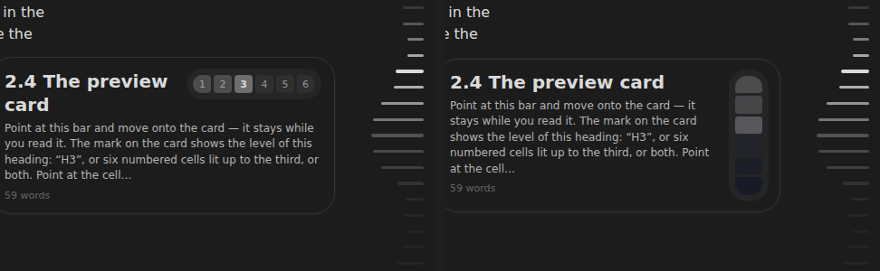

| Effect | What it changes |
|---|---|
| **Wave and trail — as in “Standard”** | Everything about the bars and the wave except colours: thickness, length, rounding, opacity, glow, caps, wave shape and strength, motion, halo, the current bar's travel. |
| **Wave and trail — as in “Funkier”** | The same, as in Funkier: thick bars, a shorter, sharper wave. |
| **Calm wave** | Softer and slower: a wider, lower wave with no overshoot; the bars follow the cursor smoothly. Motion only. |
| **Level as in “Higanbana”** | The level scale on the preview card: six numbered cells in a row, rounded, the current one highlighted. Shape and sizes only — colours stay from your preset. |
| **Level as in “Depth”** | The level scale on the preview card: vertical, wide cells, each next one deeper and darker; the cell under the cursor grows a little. |
| **Higanbana: dark marks** | For those who don't like the light parts of Higanbana: marks, pinned entries, level cells and menu buttons under the cursor become dark grey with light text. |
| **Depth: white marks** | Marks, pinned entries, the search button and the actions menu buttons become white with dark blue text and icons. |

### What is applied now

*Ready-made presets* in the settings shows the current **Preset**, and under **Applied now** — every effect and CSS add-on in use, each with a button to take it off. **Recently applied presets and effects** lists the last five presets, effects and pastes of this profile with **Apply again** and **Undo**; **Whole history…** opens the history. **Follow the theme** (on by default) keeps a preset's colours readable on your theme: never light on light or dark on dark. Colours you set yourself are never touched.

Every setting of this group: [Ready-made presets](SETTINGS.md#settings-presets).

---

## The settings screen

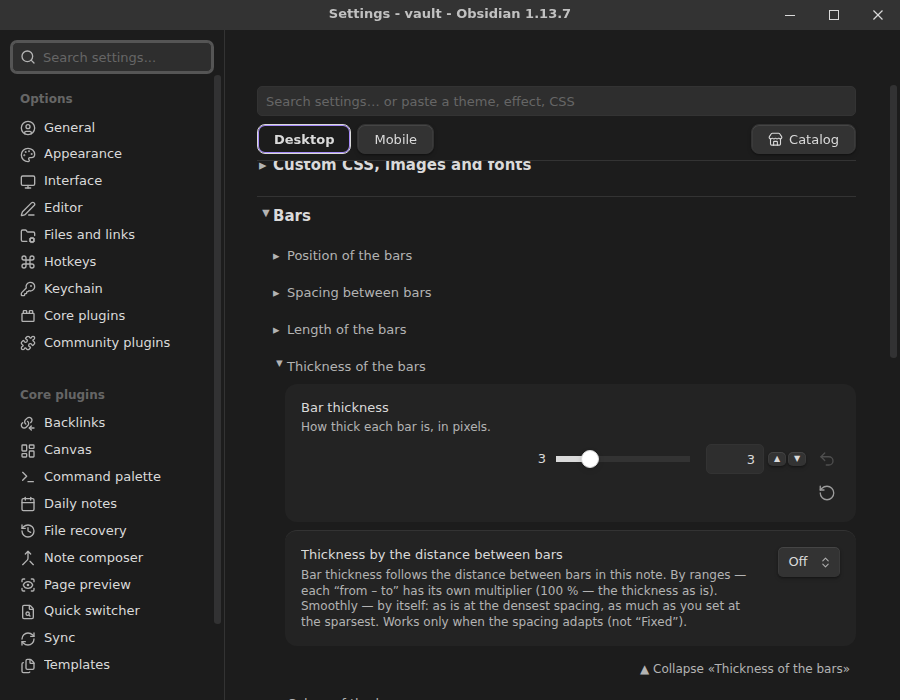

- **Desktop and Mobile tabs.** Each is a separate set of values, so the plugin can look and behave differently on a big screen and on a phone. On the Mobile tab every setting has a chain button: linked — the phone takes the desktop value; unlinked — it has its own. The settings open on the tab of the device you are on. The **Catalog** button sits right next to the tabs.
- **Groups.** **General**, **Ready-made presets**, **Custom CSS, images and fonts**, **Bars**, **Wave**, **Current bar and halo**, **Note scrolling**, **Outline** (opening it, where it stands, size, window, entries, nesting lines, folding, scrolling, marks, section actions, the Ctrl slider), **Floating button**, **Search**, **Hover preview**, **History and undo**, and **All colours** — every colour of the plugin once more in one list, each with a link to the place where it lives. Every group is made of subgroups with full names (“Bar length”, “Search box border”…), so you never scroll through a long flat list. A group opens with a click on its title and has a **Collapse** line at the bottom. A colour that follows the theme is marked **Auto**.
- **Search in the settings.** The search box and the **Desktop / Mobile** switch stay pinned at the top; **×** clears the search. The box finds a setting by its name, its description, the group it sits in and hidden keywords in every language of the plugin (Chinese and Japanese can be typed without spaces), so you can search the way you think of it — “scrollbar hover colour”, “floating button background”; word endings don't matter. Each result has a **→ section** link that takes you to that setting next to its related settings. Switching between Desktop and Mobile keeps you in the same place.
- **Paste code into the search.** A theme or a set from *Share…*, a settings file, an effect or plain CSS — paste it into the box and the plugin recognises what it is and applies it to the tab you are on; a line under the box says what was understood and has **Undo**.

  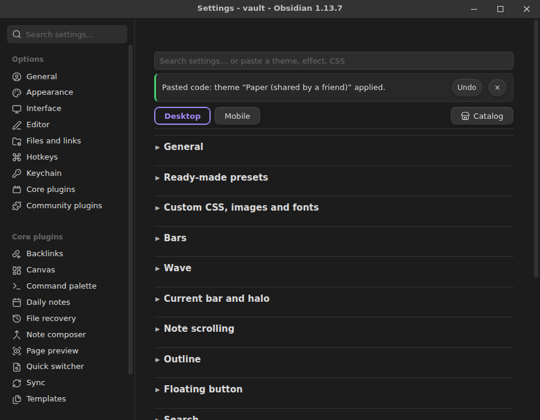
- **Numbers.** Next to every slider there is a field for the exact number. It can take a value beyond the slider's range where that makes sense (the slider then turns grey and waits). Hold **▲ / ▼** and the number keeps changing, faster the longer you hold. Some sizes can be given in pixels or in percent — of the window, of the note, or of the bars' own length.
- **Wheel and touchpad over numbers** (desktop) — the wheel changes a number one step per click, the touchpad one step per 30 px of a gesture; either can be turned the other way in *General*.
- **Back and Reset.** Every slider, number and colour has two small buttons. **Back** undoes the last change of that setting; its memory survives restarts, and the full list of changes is in the history under *Settings*. **Reset** returns the default value (for colours, the arrow returns the theme colour). A slider dragged back and forth counts as one change.
- **Colours in use right now** (at the top of *All colours*) — every colour the profile uses, identical ones grouped, with how many settings use each. A new colour from the picker goes into all of them at once, like in Figma; the arrow gives them all back the theme colour.
- **Settings in the sidebar** — *General → Where settings open → In the sidebar* (or the command *Open settings in the sidebar*): the same settings in a sidebar tab next to the note, so you change something and see the result at once. On top there is a strip of groups — one tap jumps to a group; **Keep only one section open** folds the others, **Collapse all** folds everything. Obsidian's own settings window then sends you there (**Show here** shows them in the window once).

  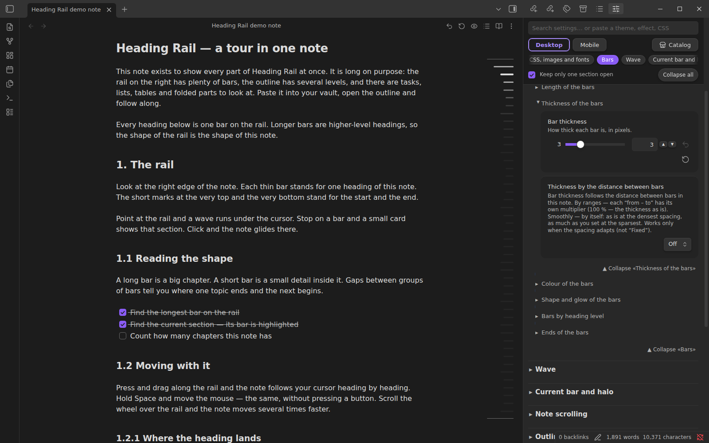
- **General** also has: **Language** (follows Obsidian by default), **Where the history opens**, **Guide** (this guide and the [What's new](README.md#whats-new) page on GitHub), **Report a bug or suggest an idea** (see [Contact](#contact)), and the main switches — see [Turning things off](#turning-things-off).

Every setting of this group: [General](SETTINGS.md#settings-general).

---

## The rail

The rail is the column of bars at the edge of the note. It is both a map and a way to move.

- Every heading gets a bar; higher-level headings get longer bars, so the shape of the rail shows the shape of the note.
- The bar of the heading you are in is highlighted.
- Two short marks at the top and bottom stand for the start and the end of the note.
- On a very long note the bars spread into several columns — at most 3 on the desktop and 2 on the phone (*Bars → Bar columns*, you can set fewer). If they still don't fit, the bars turn off and only the outline works.

**Where the bars stand** — on the right or the left, in a height band of the note you choose, with their own spacing (adapting to the note or fixed). **Each heading level** has its own length, thickness, opacity and colour. All bars share a **shape**: rounding (round by default, square at 0), a fade towards the end, and a glow with its own colour and strength.

**Gradient by place in the note** (*Colour of the bars*) — bars coloured from a top colour to a bottom colour by where their heading is, on top of the level colours.

**How deep the bars go** — up to which heading level, counted **from H1** or **from the largest heading of the note** (a note that starts with H2 then shows H2–H5). A note without headings that deep still gets bars from its largest level, instead of an empty rail.

**Thickness by the distance between bars** (right under the thickness; only when the spacing adapts). A note with few sections has its bars far apart, and thin bars look lost there. **By ranges** — up to five “from – to, px → ×” rows; **smoothly** — at the densest spacing the thickness is as is, at the sparsest it is as much as you set, and in between it changes gradually. Each note picks its value by itself.

**Bars in the neighbouring notes** (*General*, on by default) — when notes are open side by side, the inactive one keeps still, dimmed bars; clicking one makes that note active and goes to the section.

Every setting of this group: [Bars](SETTINGS.md#settings-bars).

---

## Scrolling and jumps

- **Click a bar** (or an outline entry) — the note glides to that heading.
- **Press and drag along the rail** — the note follows the cursor, heading by heading. **Hold Space** while pointing at the rail and move the mouse — the same, without a button.
- **Scroll the wheel over the rail** — the note scrolls several times faster than usual.
- **Scroll on hover** (off by default) — the note moves as the cursor simply passes over the bars.
- **Ctrl + ↑ / ↓** — step to the previous or next heading.
- **↑ / ↓ while pointing at the bars** — the preview card walks through the sections; **Enter** goes there, **Esc** cancels (or set *Go at once*).

**Where the heading lands.** At the top, in the middle, or at **your own height** — a share of the window counted from the top; by default 30 %, which looks like the middle to the eye.

**Smoothness.** Clicking, dragging, holding a finger on the phone, hovering, the wheel over the rail and the slider all move the note smoothly, without overshooting: when you move fast, the note lags a little and catches up. How soft it is — **Note scrolling smoothness** (0 — instant).

**Going back.** Every jump is remembered. The **Undo** button in the header (or the command *Go back to where you were before the last jump*) returns you to where you were reading.

**Editor scrollbar** (desktop) — hidden (the bars do its job), Obsidian's usual scrollbar, or the plugin's own thin scrollbar at the very edge, with its own thickness and colours at rest and on hover.

Every setting of this group: [Note scrolling](SETTINGS.md#settings-scroll).

---

## The wave

When the cursor comes near the rail, a wave runs along it: the bars under the cursor grow longer and brighter, their neighbours a little less.

- **Wave intensity** — the master slider: it scales length, brightness, opacity, thickness and reach together. At zero the bars stop reacting.
- **Wave shape** — **Standard** (shaped by its length, reach and **edge sharpness**), or **your own shape**: the length of every bar in the wave set by hand, in pixels.
- **Length at the peak** — the same length for all bars at the crest, or the same increase on top of each bar's own length; **Keep bar proportions** makes every bar grow by the same factor.
- **Catch-up time** and **Overshoot** give the wave its character — compare the calm, the standard and the sharp wave above.
- **Where the wave centres** — on a bar (nothing moves while the cursor stays on one bar) or freely under the cursor.
- **Reaction zone** — how far from the rail the bars start responding. **Sideways reaction** (desktop) — the wave gets weaker as the cursor moves away from the bars across them.
- **When to animate** — whether the wave moves while the outline is pinned open or peeked at with Ctrl, and whether it follows the system's “reduce motion” setting.

The quickest way to another wave is an effect from the [catalog](#effects). Every setting of this group: [Wave](SETTINGS.md#settings-wave).

---

## Current bar and halo

The bar of the heading you are in is highlighted, and a softer halo spreads to its neighbours — how many bars it reaches and how bright each step is are set like the wave. The mark can jump or **travel** to a new place with a fading trail. **Current bar lights up** — at once, or **with the halo**: the new current bar waits until the travelling light reaches it, so both move as one. Everything follows the system's “reduce motion” setting.

Every setting of this group: [Current bar and halo](SETTINGS.md#settings-glow).

---

## The outline

The outline is the list of all headings of the note. It follows your position as you read and keeps the current entry highlighted.

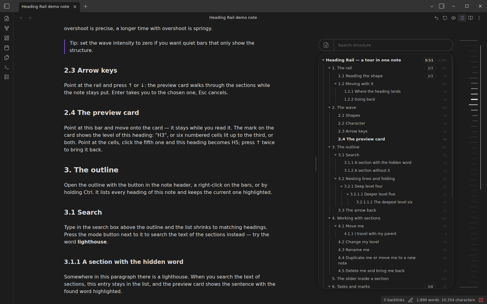

**Opening it** — the **Outline** button in the header (keeps it open), **right-click on the bars**, or **hold Ctrl** (⌘ Cmd on macOS) to peek. Or use the [floating button](#the-floating-button) instead. On the phone — the header button, or **hold a finger on a bar**: the outline opens right at that section.

**Where it stands** — next to the bars, or at the left or right edge of the note, so the bars and the outline can be on opposite sides. The bars can be turned off completely.

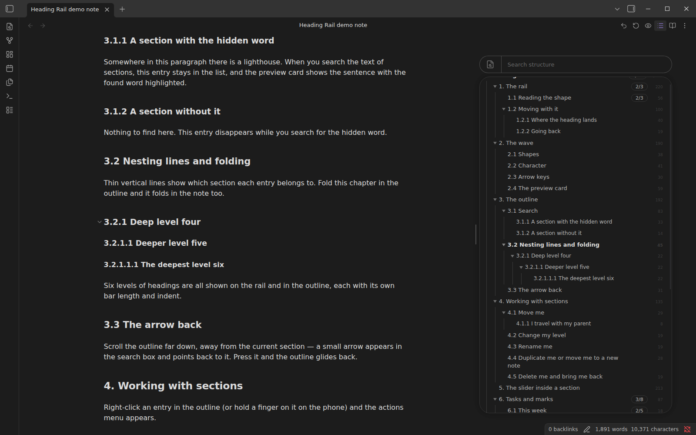

**Outline offset** — first choose how it is measured, then the number right below it:
- **From the bars: auto + value** — the outline stands past the longest bar *of this note* at the peak of the wave, plus a small margin you set. A longer wave pushes the outline farther away; a note without H1 lets it come closer.
- **From the screen edge** — at a fixed distance from the edge on the bars' side (in pixels or % of the width), whatever the bars do.

**Width** — your own, or automatic so the longest heading fits. On the desktop the outline next to the bars has a **width handle** at its far edge: drag it to make the outline wider or narrower — the note's text moves along with it; double-click it to go back to the width from the settings.

**Narrow outline** — in a narrow note the outline window lies over the text instead of squeezing it into a column, nesting indents shrink so the deepest heading still has room, and below 200 px the word count is hidden.

**Folding** — arrows next to entries with subsections, in sync with the note. **Nesting lines** — thin vertical lines showing which section each entry belongs to, with their own thickness and indent per level.

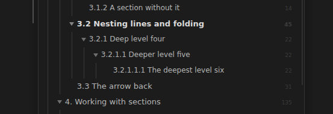

**Smooth scrolling.** The outline glides to its place: when it follows the note, on the mouse wheel and on the back arrow. On fast scrolling it lags behind a little, but the current entry never leaves the view. How soft — **Outline scrolling smoothness**. **Outline follows the wheel**: when you turn the wheel over the bars while the outline is open, it keeps the current section in the middle.

**The window.** The outline window, the preview card, the floating button and the search box can each be filled with a colour, a **gradient** (linear with an angle, or radial with its centre anywhere; where the colours meet and how soft the transition is; each colour with its own opacity) or **your own picture**. Each has a **border** and a **glow**, and the glow can change on hover — bigger, stronger, another colour, or only on hover.

**Entries** — their own **font** (any font, see [Custom CSS, images and fonts](#custom-css-images-and-fonts)), size, line height, padding, rounding and text colour on hover. **Entry fill** — the fill of an entry under the mouse, of the current entry and of selected entries. **Headings by level** — each level can have its own colour, opacity, size, weight and background.

**Safe zone.** An invisible margin around the bars, the outline and the menu: while the cursor is inside it nothing folds away.

Every setting of this group: [Outline](SETTINGS.md#settings-list).

---

## The floating button

Instead of the header button, right-click and Ctrl, the outline can open from a button over the note: *Outline → How the outline opens → Floating button only*. Funkier and Higanbana use it.

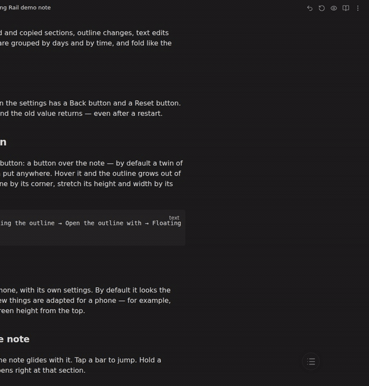

- **Hover** it — the outline grows out of it; **click** — it stays open (or set *Click only*). While it stays open, the button can show its own **icon colour and a thin border** (*While the outline is open*).
- **Button position** — where the button stands until you drag it: **across** (0 — the left edge of the note, 100 — the right) and **down** (0 — the top, 100 — the bottom). **Drag** it anywhere; it stays where you put it. **Pin here** (or the command *Pin or unpin the floating button*) fixes it: the button keeps its distance from the nearest window corner and can no longer be dragged by accident.
- **Where the outline opens** — where there is more room, always beside (left / right), or always above / below the button. In a narrow window the outline stays by the button, and the preview goes on the other side.
- **Outline size at the button** — the whole outline — text, icons, spacing — proportionally smaller or larger, in percent. On a phone 70–80 % is comfortable.
- **Distance from the button** — one number for every side; 0 is the same as between the search box and the outline. **How the outline appears** — grows out of the button, or appears at once.
- **Size** — by default the same height as the search box, with the same glow, so the two look like a pair; set your own and they change independently. Icon, rounding, colours, opacity, border, glow and background (colour, gradient or picture) are adjustable.

**Resizing the floating outline.**

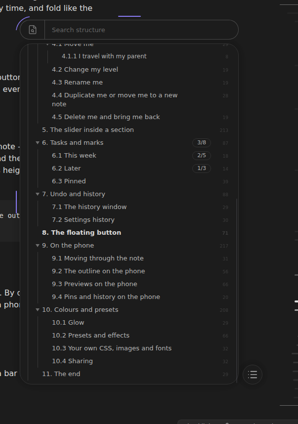

- **Drag the corner** farthest from the button — the whole outline grows or shrinks in proportion. The arrow resets the size.
- **Drag the far edge** (a short bar in its middle) to make the outline taller or shorter, and the **side edge** (desktop) to make it wider or narrower. When the height bar appears — always, only when the list scrolls, or from a number of entries.

Every setting of this group: [Floating button](SETTINGS.md#settings-float).

---

## Working with sections

A **section** is a heading with everything under it — its text and its subsections.

### Selecting

- **Right-click** an entry — it is selected and the actions menu opens; right-click again to unselect.
- **Shift + click** — a range; **Alt + click** — add or remove one entry; **Esc** — clear.
- On the phone: **hold a finger** on an entry.

### The actions menu

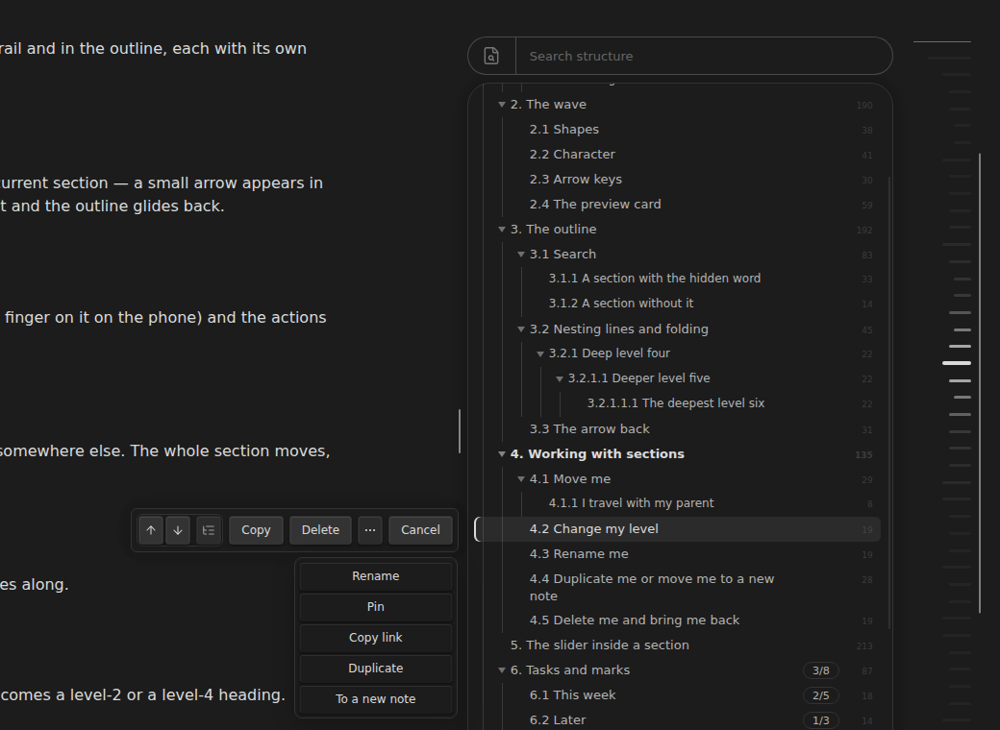

| Action | What it does |
|---|---|
| **↑ / ↓ level** | Raises or lowers the heading level. |
| **Rename** | Edits the heading right in the outline; shows how many links point to it. |
| **Pin** | Adds the section to the [pinned list](#pinned-sections). |
| **Copy link** | Copies a link to the heading. |
| **Copy** | Copies the whole section (or all selected sections). |
| **Duplicate** | Inserts a copy right after it, with “(copy)” added to the heading. |
| **To a new note** | Moves the text into a new note named after the heading; the heading stays with a link to it. |
| **Delete** | Deletes the section; it can be restored from the history. |

**Where the menu stands** — beside the outline (a strip on whichever side has room; its buttons can be **icons with tooltips** instead of words, so it covers less text), or as a block above or below it. **How it appears** — slides out, grows from the centre, or appears at once, with its time and **effect strength** (0–10). **Which buttons** — for each action: always visible, in the second row (“⋯”), or hidden. In a narrow window, when the strip doesn't fit on either side, its buttons stand in a **column**; the menu never goes past the window. Background, button fill, text colours, rounding and glow are yours, and buttons can have their **own colours on hover**.

### Heading level

↑ / ↓ in the menu (or the arrow keys) change the level. By default the whole branch moves; the switch in the menu makes it only the selected heading. If a nested heading is already at level 1 or 6, the arrow shows a hint with **Only this heading** and **Always only the heading**. Headings underlined with `===` / `---` cannot be changed by the plugin.

### Moving sections

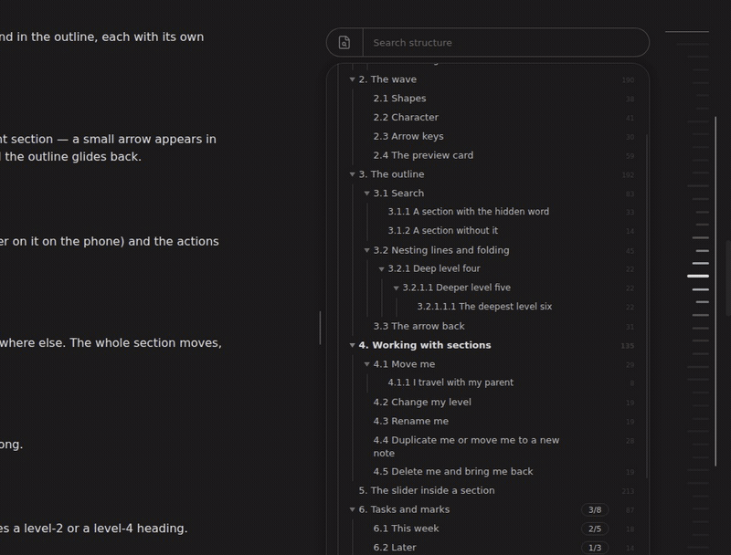

- **With the mouse** — grab an entry and drop it. Onto an entry — it becomes a subsection (at the start or the end); between entries — it stands next to them. A line shows where it lands and at which level.
- **With the keyboard** — with a section selected: **Alt + ↑ / ↓** (⌥ Option on macOS) or **right Shift + ↑ / ↓** move it past its neighbour.
- **On the phone** — hold a finger until the menu opens, then move without lifting it.

After a move or a level change the entry briefly flashes in the outline so you can see where it went.

### Renaming, deleting, restoring

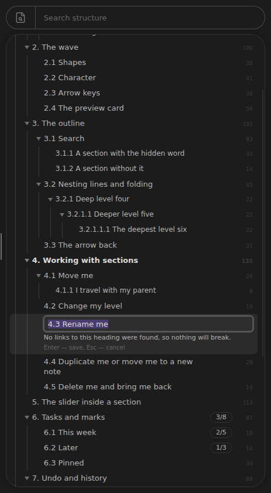

Renaming warns how many links point to the heading — Obsidian does not update heading links by itself. Deleted sections go to the history: **Restore** puts a section back where it was, even after later edits (it finds the place by the neighbouring lines; if it cannot, it asks and restores at the old line number).

Every setting of this group: [Section actions](SETTINGS.md#settings-a-actions).

---

## Search

The search box sits above the outline, or below it — **Search at bottom** (set separately for the desktop and the phone). Its height is adjustable; the mode button grows with it. With the largest rounding the box stays pill-shaped at any height.

**While you type**, the outline shrinks to the matches — towards the search box, which stays exactly where it is, so the cursor never loses it. **Esc** or **✕** clears the search.

**The mode button** next to the box switches between searching **headings** and searching the **text of sections**. When it is on, it gets an outline and a brighter icon.

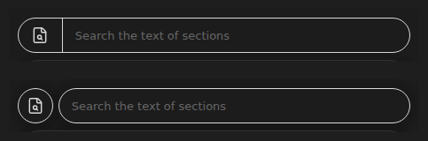

- **Look** — *Apart*: its own round button next to the box; *Joined*: one rounded box split by a straight line. In the joined look the whole box lights up together when the mode is on.
- **Side** — left or right. **Colours and brightness** of the icon at rest, on hover and when on; the **border** of the box at rest, on hover and while the text search is on.

**Searching the text.** Opening a match takes you to the found word and highlights it in the note and in the preview card — with an **underline** (thickness, colour, distance from the line) or a **fill with a border**.

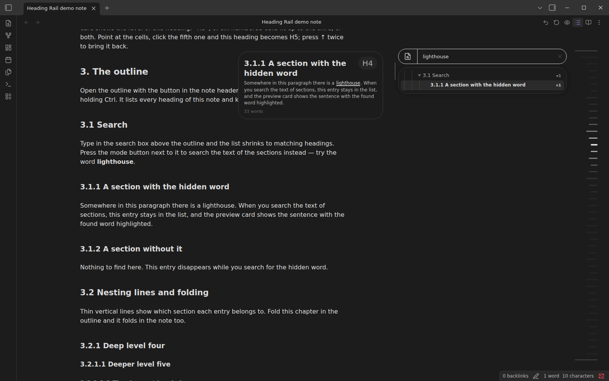

**“Back to the current section” arrow.** When you scroll the outline far away from the current section, a small arrow appears in the search box — up or down, towards the section. Press it and the outline brings the section back into view.

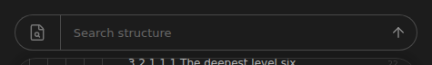

**On the phone**, the keyboard doesn't get in the way: when it opens, the outline stays open and stretches down to the keyboard, the results follow what you type, and when the keyboard hides the outline grows back. Tapping a section with the found word hides the outline and shows the word in the note; open the outline again and the same search is still there.

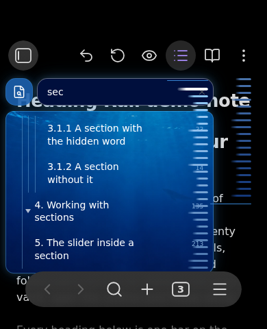

Every setting of this group: [Search](SETTINGS.md#settings-search).

---

## Ctrl + hover: the slider inside a section

*Desktop only.* Hold **Ctrl** (⌘ Cmd) and point at an outline entry: only the part to the left of the cursor fills up, like a battery level; dots along the top edge are the scale.

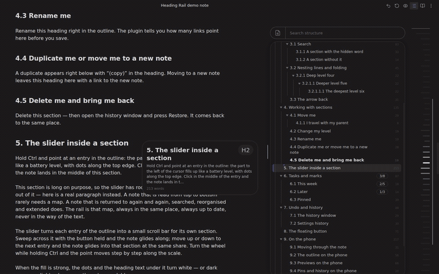

- **Click** — land at the same share of the section (the middle of the entry — the middle of the section, subsections included).
- **Hold the left button and move** — the note glides after the cursor, even into the next sections.
- **When the slider shows** — with Ctrl only, or on every hover (then a plain click already lands at that point).
- **Moving the note along** — with Ctrl + mouse button, or with **just Ctrl**: the note follows as soon as Ctrl is held.
- **Ctrl + wheel** over an entry moves the point step by step along the scale: the note follows straight away, or only the mark moves and a click takes you there. A touchpad gesture moves it too; the wheel and the touchpad can each be turned the other way.
- **Snap to the dots** — near a dot the slider lands exactly on it.

The whole slider can be switched off with **Slider inside a section**. Every setting: [Slider inside a section](SETTINGS.md#settings-sl-slide).

---

## Pinned sections

Select a section and press **Pin** (or use the command *Pin the current section (or unpin it)*).

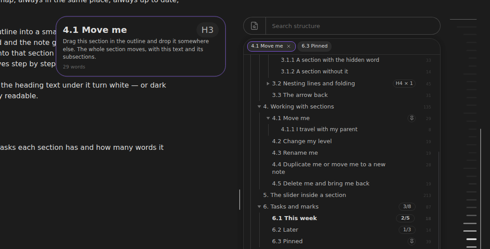

- Pinned sections get a pin icon and are listed at the top of the outline — click one to jump there.
- **Preview of a pinned entry** (desktop) — point at an entry in the pinned list and its preview card appears, framed so you don't confuse it with an ordinary one.
- **Next / previous pinned section** — commands you can give hotkeys.
- **Unpin** — on the desktop rest the cursor on a pinned entry or a pin icon: after a short pause a small **✕** appears right next to it — click it; or press **Delete** while the cursor is on the entry. On the phone **hold a finger** on the pin or its entry in the list.
- Pinning and unpinning can be undone with the **Undo** button.

---

## Marks next to entries

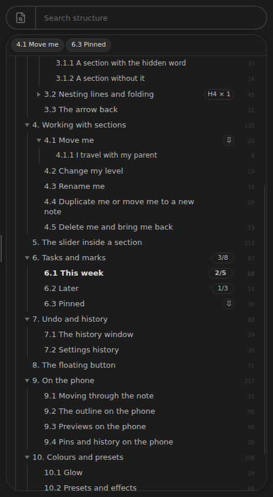

- **Word count** — words in the section, subsections included.
- **Open tasks** — unchecked `- [ ]` tasks in the section alone or with its subsections, shown as **“7”** (open), **“4/11”** (done of all) or **“7/11”** (open of all).

  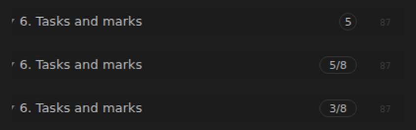
- **Pin mark** and **folded section mark** (for example “H3 × 4”).

All marks are the same height, with their own fill, text colour and border; one opacity setting covers the text, icons and borders of all of them. They can have **their own font, weight and a faint glow** (*Mark text and glow*). The pin mark has its own fill too, and the **pinned entries at the top of the list** have their own background, text, border and colour of the unpin cross.

Every setting of this group: [Marks next to outline items](SETTINGS.md#settings-m-marks).

---

## Undo and history

### The undo button

The **Undo** button in the header (and the command *Undo the last outline action*) takes back, one step at a time, **every action of the plugin**: moves, renames, level changes, duplicates, moves to a new note, deletions, pinning and unpinning, pinning the floating button, and turning the plugin off in a note. It also returns you to where you were before a jump. With **What the undo button undoes → All edits of the note** it takes back ordinary typing too. Undo keeps working after later edits; if the exact place was edited afterwards, it asks first.

### The history

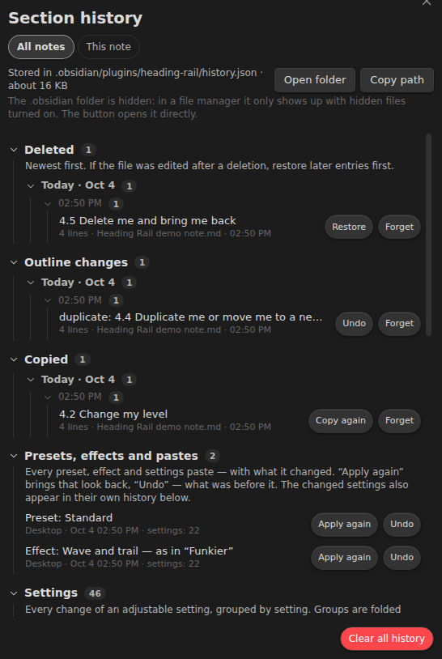

**Where the history opens** (*General*): as a window, or **in the sidebar** — next to the note, updating by itself.

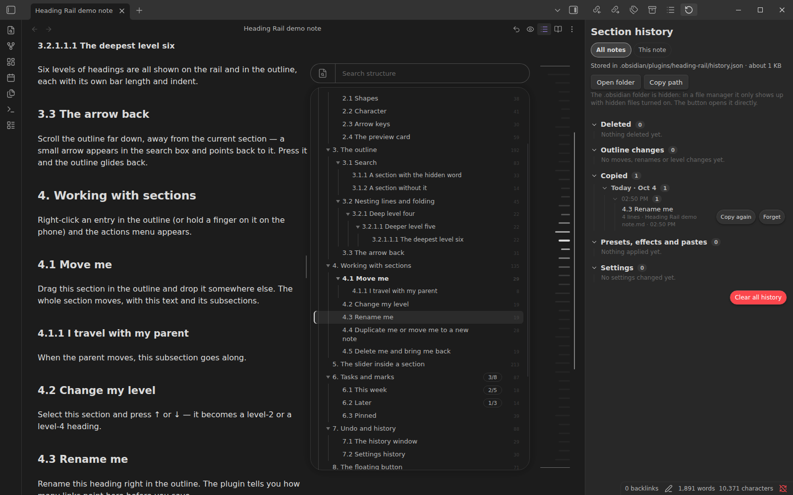

- **Sections** — Deleted, Outline changes, Text edits, Copied, **Presets, effects and pastes** and **Settings**, each with its number of entries.
- **Presets, effects and pastes** — every preset, effect and pasted theme, set or CSS, with its time and how many settings it changed: **Apply again** brings that look back, **Undo** returns what was before it.
- **Date blocks** — today, 2–3 days, 4–7 days, then a block for every further week. Inside a block the entries are grouped by time.
- Sections, blocks and groups fold like the outline, with nesting lines.
- **All notes / This note** — the whole history, or the entries of the open note.
- **Settings** — every change of an adjustable setting, grouped by setting: see the latest changes, open the whole history of one setting, set a value back, or clear it.
- **Clear all history** — press twice.

How much is kept, the order of sections and where the history is stored: [History and undo](SETTINGS.md#settings-history).

---

## Hover preview

Stop on a bar (or, if you choose, on an outline entry) and a card shows the heading, its level, the start of its text and the word count.

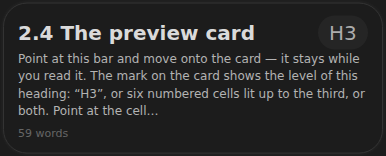

### Reaching the card

On the desktop the card stays while the cursor is on it — you can read it and change the heading level from it. Moving towards the card, even quickly and across the text of the note, does not make it disappear or switch to a neighbouring section. You don't have to hit a bar exactly either: in the **preview zone** the card appears for the heading at the cursor's height. **Keep the preview while the cursor is on it** can be switched off.

### Where it stands

- **Preview offset** — **From the bars: auto + value** (past the longest bar *of this note* at the peak of the wave, plus **Added to the bars** — the longest bar never covers the card) or **From the screen edge** (a fixed distance from the edge on the bars' side).
- **Distance from the outline** — its own number, used when the card stands beside the outline.
- **Not higher than** — the card never rises above this distance from the top of the screen. On the phone it is 15 % by default, so the card stays clear of the system bar.
- **Where it appears** — beside the bars, or beside the outline when you point at the outline or it is open.
- **When there is no room beside the outline** — in a narrow window and on the phone the card goes below or above the outline. **Outline by the button** (default): the outline stays by the floating button and the card goes on the other side. Or always **below** or **above**. The card is as wide as the outline, never lies over the bars, and the outline keeps its place for it (**Height kept for the preview**), so nothing jumps.

  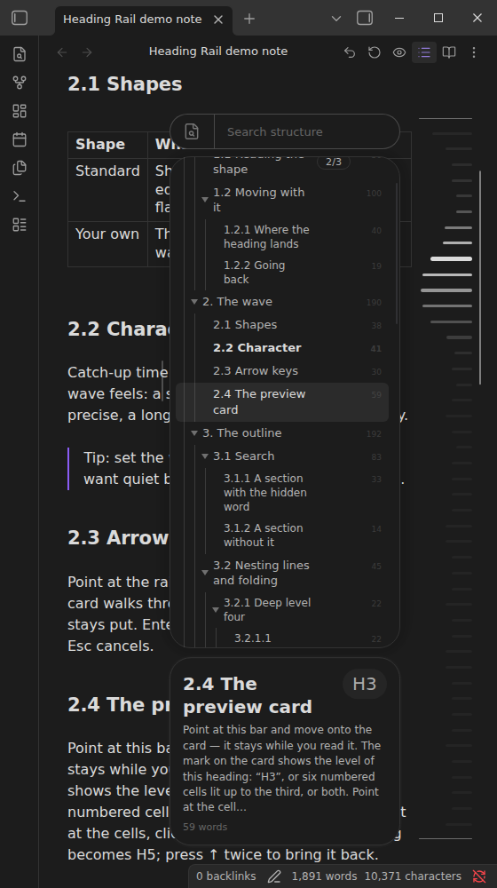
- **The preview's picture** — beside the outline the picture can follow the card's movement, or share one picture with the outline across the whole note; below / above the outline the card and the outline can share one backdrop. *Depth* has all three on.
- **Line the card up with** — beside the outline, its middle is level with the outline entry or with the bar. **Resize with the outline** — when the floating outline is resized, the card grows or shrinks too.
- **While searching the text** — the card shows the piece of text with the found word highlighted, or does not appear.

### The level mark

The card shows the level of its heading in one of three looks (**Look of the heading level**):

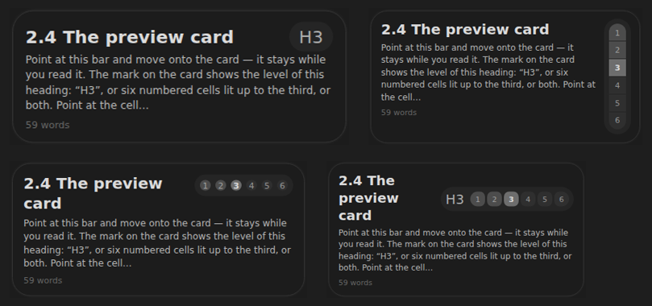

- **Level number (H4)** — “H4” by the title or in a corner, with its own size, weight, colour, backdrop and glow; bolder for H1 and thinner for H6 automatically, or set for each level.
- **Numbers 1–6 (scale, dots, pills)** — six cells in a row (vertical at the side of the card or horizontal), lit up to the level, with ready-made looks **Scale**, **Dots** and **Pills**. Every state — rest, hover, press, current, above and below the current level — has its own size, weight, colour, fill and rounding; **cuts** between cells; the cell under the cursor can grow.
- **Level number and numbers 1–6** — both at once, in one backdrop or two.

**Size of the whole level zone** — one slider scales everything at once. **Preview enlargement on hover** (desktop) — the whole card grows smoothly while the cursor is on it. Two catalog effects, [Level as in “Higanbana” and as in “Depth”](#effects), set the whole scale in one click.

**Changing the level from the card** (desktop): point at a cell and click it, or pick H1…H6 from the number's menu; **↑ / ↓** anywhere on the card — one level up or down. Nested sections move along.

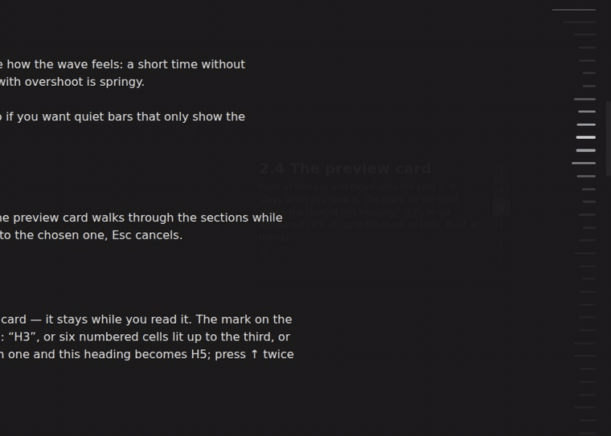

### Animation

- **How it appears** — from the side, from the top, from the bottom, from the centre, or without animation, with its time and **effect strength** (0–10).
- **Previews one after another** — the card does not disappear but glides to the next section and changes its content.

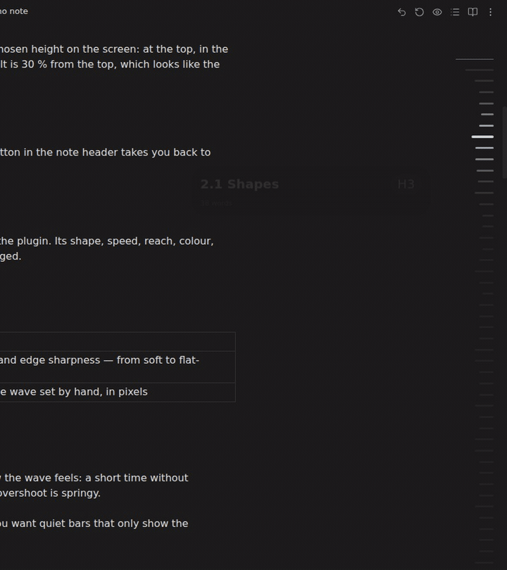

Every setting of this group: [Hover preview](SETTINGS.md#settings-preview).

---

## Custom CSS, images and fonts

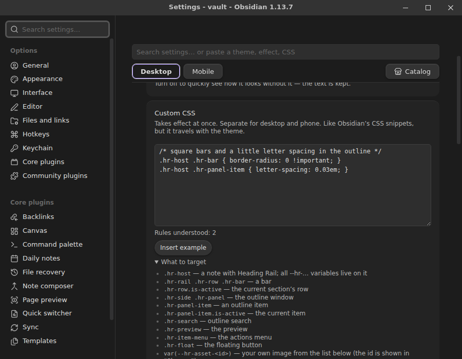

- **Custom CSS** — your own CSS for the plugin, applied at once, separately for the desktop and the phone. It travels with the theme: *Share…* and the settings file include it. *Rules understood: N* under the box shows whether the browser could read it; **Insert example** and **What to target** (`.hr-host`, `.hr-bar`, `.hr-row.is-active`, `.hr-panel`, `.hr-panel-item`, `.hr-search`, `.hr-preview`, `.hr-item-menu`, `.hr-float`) help to start. The switch above turns it off without losing the text. Only CSS — no JavaScript.
- **Your images** — add pictures from the device (large ones are scaled down to 1600 px). Then pick **Your image** as the background of the outline window, the preview, the search box or the floating button, and set its **visibility** (100 — as it is; lower — the background colour lies over it so text stays readable), **blur**, **what to anchor it to** (centre, an edge or a corner — that part stays put when the window changes size) and how it fills (fill and crop, whole image, tile). **Delete** next to the choice removes the picture. When the search box takes the outline's background, the picture is **one canvas** across both.
- **GIF backgrounds** — a GIF (up to 20 MB) is added like any picture and moves. It is kept as a file in the plugin's folder, not in the settings, and is never blurred. **Animate GIFs** turns the movement off per device — then the first frame stays still, for example on the phone.
- **Your fonts** — add .ttf, .otf, .woff or .woff2 files; the font then appears in every font list of the plugin. Any font installed on the device or chosen in Obsidian can be used without adding it: **Other font…** in a font list, then type its name. *Eastern serif (Mincho)* is in every list and renders in any language.

Every setting of this group: [Custom CSS, images and fonts](SETTINGS.md#settings-custom).

---

## Sharing and moving settings

- **Share your own preset** (*Ready-made presets*) → **Share…** — choose what to send: Desktop, Phone, both, or *Effect* (bars and wave without colours, to put on top of any preset). Your custom CSS goes with it, and so do your images and fonts that the set uses. **Copy the settings** puts the code on the clipboard, **Save to file** writes it into the vault (needed when images or fonts are included — they don't fit into an e-mail), **Open an email** opens your mail app with a letter to the author. Nothing is sent by itself. Checked presets appear in the catalog for everyone.
- **Paste** — anything from *Share…*, a settings file, an effect or CSS: in the **Paste…** window or straight into the settings search box. A pasted theme changes only the plugin's look, not the rest (language, history…). Every paste can be undone, and an effect pasted as code appears in the catalog under *Downloaded*.
- **Settings file** — save all settings to a file or paste them back, for a backup or another vault. It includes your images and fonts.

---

## On the phone

Everything works on the phone, with its own profile of settings (the **Mobile** tab). By default the phone looks the same as the desktop: the same preset, bars, wave, rounding, buttons and marks. Only a few things are adapted because a phone needs them: the outline stands 15 % of the screen height from the top, the bars keep a few pixels from the very edge (where Obsidian's swipe lives), and there is no hover zone or Ctrl.

<table>
<tr>
<td width="33%" valign="top">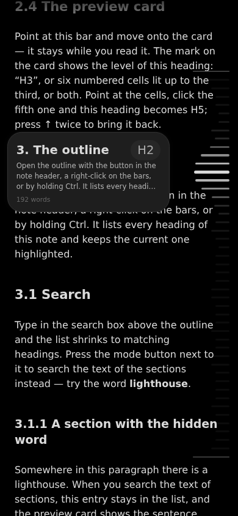 A finger on the rail, the preview above it.</td>
<td width="33%" valign="top">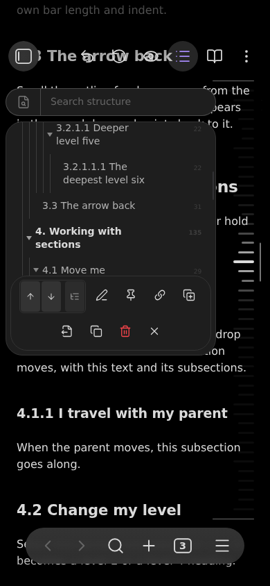 The outline; a held entry gets the actions menu.</td>
<td width="33%" valign="top">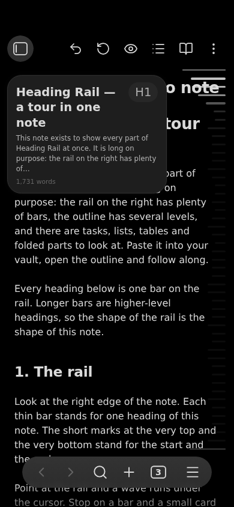 The card across the width of the screen.</td>
</tr>
</table>

- **Tap a bar** to jump; **slide a finger along the rail** to move smoothly through the note (a sideways swipe is left to Obsidian and doesn't move the note; sliding along the rail never opens Obsidian's command palette); **hold a finger on a bar** to open the outline at that section.
- **The outline button in the note header** opens and closes the outline with one tap. **Outline position on the phone** — near the top, near the bottom (when Obsidian's bar covers the top), or at the middle of the bars, with top and bottom margins.
- **In the outline:** hold a finger on an entry for the actions menu (one, at the bottom of the outline); move without lifting to drag the section.
- **Search** is above the outline by default (**Search at bottom** moves it below). The keyboard doesn't collapse the results — see [Search](#search).
- **Previews** appear while you slide along the bars. With the outline open, the card goes below or above the outline, and the outline leaves room for it. By default the card **fills the width of the screen** and everything inside scales with it. The level mark is shown too; it is changed only on the desktop.
- **The floating button** works with touch too; *Outline size at the button* makes the outline smaller for a phone (Higanbana uses 75 % with the button at the top left and the outline opening downward).
- **Tasks next to the bars** (on by default). With the bars on the left they lie over the start of the text, so lines with tasks move to the right by themselves — every checkbox can be tapped. Only task lines move; with the bars on the right nothing changes.
- **Unpin** by holding a finger on a pin.
- **Use the plugin on this phone** — switch the plugin off on the phone only, if Obsidian's edge swipe gets in the way.

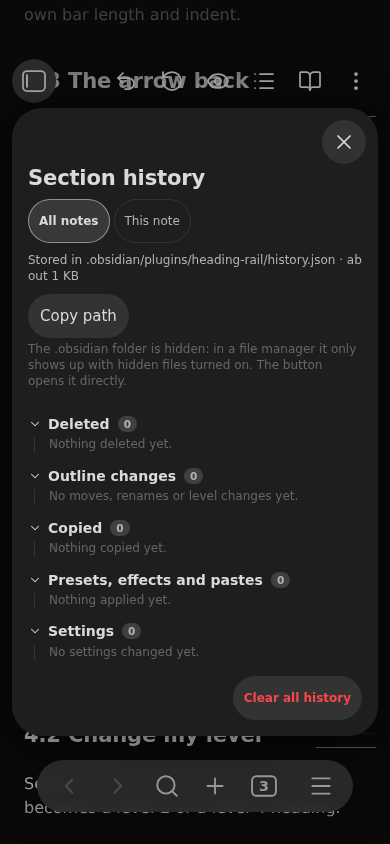

---

## Turning things off

- **In one note** — the **eye** button (or the command) turns the whole plugin off in that note; the plugin can remember it, or write it into the note as the property `heading-rail: off`. Undo brings it back.
- **Bars or outline** — the **Bars** and **Outline** switches in *General*, and the commands *Show or hide the bars* and *Turn the outline on or off*.
- **On short notes** — **Only on notes with at least** N headings.
- **On the phone** — **Use the plugin on this phone**.

---

## Keys and gestures

| Action | Windows / Linux | macOS | Phone |
|---|---|---|---|
| Jump to a heading | Click a bar or an entry | Click a bar or an entry | Tap |
| Move through the note along the rail | Drag along the rail, or hold Space and move | Same | Slide a finger along the rail |
| Open the outline at a section | Right-click on the bars | Right-click (two-finger click) | Hold a finger on a bar |
| Previous / next heading | Ctrl + ↑ / ↓ | ⌘ Cmd + ↑ / ↓ | — |
| Walk through sections over the bars | ↑ / ↓ while pointing at the bars, Enter — go, Esc — cancel | Same | — |
| Peek at the outline | Hold Ctrl | Hold ⌘ Cmd | — |
| Select a section | Right-click the entry | Right-click the entry | Hold a finger on the entry |
| Select a range / one more | Shift + click / Alt + click | Shift + click / ⌥ Option + click | — |
| Clear the selection | Esc | Esc | Cancel in the menu |
| Change the level of the selected section | ↑ / ↓ | ↑ / ↓ | Level arrows in the menu |
| Move the selected section | Alt + ↑ / ↓ or right Shift + ↑ / ↓ | ⌥ Option + ↑ / ↓ or right Shift + ↑ / ↓ | Hold and drag |
| Delete the selected sections | Delete / Backspace (pointing at the outline) | Delete (⌫) | Delete in the menu |
| Slider inside a section | Ctrl + hover / click / drag | ⌘ Cmd + hover / click / drag | — |
| Step inside a section | Ctrl + wheel over an entry | ⌘ Cmd + wheel | — |
| Change the level on the preview card | ↑ / ↓ on the card, or click a cell | Same | — |
| Unpin | Rest the cursor on the pin, click ✕ (or Delete) | Same | Hold a finger on the pin |
| Rename: save / cancel | Enter / Esc | Enter / Esc | Enter |
| Clear the search | Esc | Esc | ✕ |

---

## Commands

All commands are in the command palette; any of them can get a hotkey in **Settings → Hotkeys**.

| Command | What it does |
|---|---|
| Open the catalog of presets and effects | Opens the [catalog](#the-catalog). |
| Open settings in the sidebar | The plugin's settings next to the note. |
| Open the history | The history window (or the sidebar tab). |
| Delete selected sections | Deletes the sections selected in the outline. |
| Copy selected sections | Copies them to the clipboard. |
| Restore last deletion | Puts back the most recently deleted section. |
| Undo the last outline action | Same as the undo button in the header. |
| Go back to where you were before the last jump | Returns to your reading position. |
| Show or hide the bars | Switches the bars on or off. |
| Turn the outline on or off | Switches the outline on or off. |
| Pin the current section (or unpin it) | Pins the section the cursor is in. |
| Go to the next / previous pinned section | — |
| Pin or unpin the floating button | Fixes the floating button where it stands, or frees it. |
| Turn Heading Rail on or off in this note | Same as the eye button. |

---

## Questions and problems

**Nothing shows up in a note.** Check that the note has enough headings (**Only on notes with at least**), that the plugin is not switched off in this note (eye button), that **Bars** and **Outline** are on, and on the phone — **Use the plugin on this phone**.

**The catalog is empty or shows no screenshots.** It needs an internet connection: press the round arrow (**Refresh catalog**). Without a connection you still see Standard and everything you have downloaded.

**A preset I used disappeared after an update.** Since 10.5 presets live in the catalog. What you already used downloads by itself; if something is missing, open the catalog and press **Download**.

**The level arrow shows a hint.** A nested heading of the branch is already at level 1 or 6 — choose **Only this heading**.

**Undo asks “The note has changed since then”.** The place the action touched was edited afterwards; **Undo anyway** brings the old text back there.

**Links to a heading stopped working after renaming.** Obsidian does not update heading links by itself; the rename field shows how many links there are before you save.

**Where is the history file?** `.obsidian/plugins/heading-rail/history.json` — the folder is hidden; use **Open folder** in the settings or the history window.

**On the phone, swiping near the edge opens Obsidian's sidebar.** Move the bars to the other side, or switch the plugin off on the phone.

**A setting went wrong and I don't remember the old value.** Press **Back** next to it, or find it in the history under *Settings*.

**Something doesn't work, or the interface moved somewhere?** Almost certainly it's the code, not you — please write, see [Contact](#contact).

---

## Contact

A word from the author:

> I'm not a programmer at all and never even opened the code of this plugin, it's written fully by AI from my ideas, because of that it's not perfect at all since there's just no normal professional person who could check it, so it can have all kinds of bugs depending on devices, on apple i didn't test at all, so if something doesn't work for you - interface moved somewhere or a setting doesn't work - the problem isn't you, it's the code, please write about every bug as detailed as possible and it will be fixed as fast as possible on your request, don't wait for it to go away by itself, unlikely, and while you don't write i most likely don't even know about it

- **Report a bug or suggest an idea** in the settings opens your mail app with a letter to the author; the plugin version, Obsidian version, system and theme are already filled in.
- [GitHub issues](https://github.com/JustDast/obsidian-heading-rail/issues).
- Made a fork that is genuinely better? Send the source and how you did it. If it really is better, it goes into the next version and you are credited as a co-author.
